#### Diseñar un diagrama de arquitectura en Visio (u otra herramienta similar) que incluya los principales servicios de Azure necesarios (App Services, Azure SQL, Blob Storage, Application Gateway, etc.).

```mermaid
%%{init: {'theme': 'default'}}%%
graph LR
    %% ------------------ Internet Layer -------------------
    subgraph Internet
        direction LR
        A[Navegador Web Estudiante/Docente]
    end

    %% ------------------ Azure Virtual Network -------------------
    subgraph Azure Virtual Network
        direction LR

        %% ------------------ Subnet Edge -------------------
            B[Azure App Gateway WAF]
        %% ------------------ Subnet APIM -------------------
            X[Azure API Management]
        AS[Azure App Service AutoScale]

        %% ------------------ Subnet Frontend AutoScale -------------------
        subgraph Frontend AutoScale Subnet
            direction LR
            C1[Frontend 1]
            C2[Frontend 2]
            C3[Frontend N]
        end

        %% ------------------ Subnet Backend AutoScale -------------------
        subgraph Backend AutoScale Subnet
            direction LR
            D1[Backend 1]
            D2[Backend 2]
            D3[Backend N]
        end

        %% ------------------ Subnet Data -------------------
        subgraph Data Subnet
            E[Azure SQL DB HA + Backup]
            F[Azure Blob Storage]
        end

        %% ------------------ Subnet Security -------------------
            KV[Azure Key Vault]

        A -- "<span style='background-color:#aaffaa;'>HTTPS</span>" --> B
        B -- "<span style='background-color:#aaffaa;'>WAF + Balanceo</span>" --> X
        X -- "<span style='background-color:#aaffaa;'>Proxy Seguro API (AAD Auth)</span>" --> AS
        AS -- "<span style='background-color:#fdd;'>Gestiona</span>" --> C1 & C2 & C3
        AS -- "<span style='background-color:#fdd;'>Gestiona</span>" --> D1 & D2 & D3
        C1 -- "<span style='background-color:#e0f8f8;'>API Call</span>" --> D1
        C2 -- "<span style='background-color:#e0f8f8;'>API Call</span>" --> D2
        C3 -- "<span style='background-color:#e0f8f8;'>API Call</span>" --> D3
        D1 -- "<span style='background-color:#e0e0ff;'>Consulta SQL</span>" --> E
        D2 -- "<span style='background-color:#e0e0ff;'>Consulta SQL</span>" --> E
        D3 -- "<span style='background-color:#e0e0ff;'>Consulta SQL</span>" --> E
        D1 -- "<span style='background-color:#a0daff;'>Almacenar Archivo</span>" --> F
        D2 -- "<span style='background-color:#a0daff;'>Almacenar Archivo</span>" --> F
        D3 -- "<span style='background-color:#a0daff;'>Almacenar Archivo</span>" --> F
        KV -- "<span style='background-color:#ffe082;'>Secrets / Tokens</span>" --> AS & D1 & D2 & D3
    end

    subgraph Azure Monitoring Services
        direction LR
        H[Azure Monitor]
        LA[Log Analytics]
    end

    subgraph Azure Disaster Recovery
        SR[Azure Site Recovery]
    end

    subgraph Azure Identity
        G[Azure AD]
    end

    H -- "Recopila métricas de" --> AzureVirtualNetwork
    LA -- "Recopila logs de" --> AzureVirtualNetwork
    SR -- "Protege" --> AzureVirtualNetwork
    AzureVirtualNetwork -- "Envía logs y métricas a" --> H & LA
    AzureVirtualNetwork -- "Es protegido por" --> SR
    AS -- "Envía logs y métricas a" --> H & LA
    B -- "Envía logs y métricas a" --> H & LA
    X -- "Envía logs y métricas a" --> H & LA
    C1 -- "Envía logs y métricas a" --> H & LA
    C2 -- "Envía logs y métricas a" --> H & LA
    C3 -- "Envía logs y métricas a" --> H & LA
    D1 -- "Envía logs y métricas a" --> H & LA
    D2 -- "Envía logs y métricas a" --> H & LA
    D3 -- "Envía logs y métricas a" --> H & LA
    E -- "Envía logs y métricas a" --> H & LA
    F -- "Envía logs y métricas a" --> H & LA
    G -- "<span style='background-color:#ffe082;'>Autentica</span>" --> X
    G -- "<span style='background-color:#ffe082;'>Autentica</span>" --> AS
    G -- "<span style='background-color:#ffe082;'>Autentica</span>" --> B


    %% ------------------ Estilos -------------------
    style A fill:#f9f,stroke:#333,stroke-width:1px
    style B fill:#aaffaa,stroke:#333,stroke-width:1px
    style X fill:#aaffaa,stroke:#333,stroke-width:1px
    style AS fill:#fdd,stroke:#333,stroke-width:1px
    style C1 fill:#e0f8f8,stroke:#333,stroke-width:1px
    style C2 fill:#e0f8f8,stroke:#333,stroke-width:1px
    style C3 fill:#e0f8f8,stroke:#333,stroke-width:1px
    style D1 fill:#e0e0ff,stroke:#333,stroke-width:1px
    style D2 fill:#e0e0ff,stroke:#333,stroke-width:1px
    style D3 fill:#e0e0ff,stroke:#333,stroke-width:1px
    style E fill:#cc99ff,stroke:#333,stroke-width:1px
    style F fill:#cc99ff,stroke:#333,stroke-width:1px
    style KV fill:#ffe082,stroke:#333,stroke-width:1px
    style H fill:#b2ebf2,stroke:#333,stroke-width:1px
    style LA fill:#b2ebf2,stroke:#333,stroke-width:1px
    style SR fill:#ffcc80,stroke:#333,stroke-width:1px
    style G fill:#ffe082,stroke:#333,stroke-width:1px
```

### **Justificar brevemente las decisiones tomadas sobre los principales componentes utilizados.**
Esta arquitectura en Microsoft Azure se ha diseñado cuidadosamente para cumplir con los requisitos funcionales y técnicos de la plataforma educativa, priorizando la escalabilidad, disponibilidad, seguridad, resiliencia y eficiencia operativa, tal como lo solicitó la institución.
-	Azure Application Gateway con WAF: Es fundamental como punto de entrada seguro a la aplicación web. El WAF protege contra vulnerabilidades comunes, mitigando riesgos de seguridad desde el perímetro. El balanceo de carga inicial distribuye el tráfico, mejorando la disponibilidad y la capacidad de respuesta.
-	Azure API Management: Proporciona una capa de gestión centralizada para las APIs del backend. Esto facilita la seguridad (autenticación con AAD), el control de acceso, la monitorización del uso de las APIs y la futura evolución de la plataforma al desacoplar el frontend del backend.
	Azure App Service (Frontend y Backend con Autoescalado): Ofrece una plataforma PaaS robusta y escalable para alojar la lógica de presentación y de negocio. El autoescalado permite a la plataforma adaptarse dinámicamente a la demanda, optimizando costos y garantizando la disponibilidad durante picos de uso. La separación en frontend y backend facilita la gestión y el escalado independiente de cada capa.
-	Azure SQL Database (HA + Backup): Proporciona una base de datos relacional gestionada, altamente disponible y con mecanismos de respaldo automatizados, cumpliendo con los requisitos de persistencia de datos críticos y continuidad operativa. La alta disponibilidad asegura que la plataforma permanezca accesible en caso de fallas.
-	Azure Blob Storage: Ofrece un almacenamiento de objetos escalable y económico para los archivos no estructurados de la plataforma. Su durabilidad y disponibilidad son cruciales para la integridad de los documentos importantes.
-	Azure Active Directory (AAD): Permite una gestión centralizada de identidades y accesos, facilitando la autenticación de estudiantes y docentes y la implementación de políticas de seguridad basadas en roles, integrándose con los requisitos de seguridad de la institución.
-	Azure Key Vault: Asegura la gestión segura de secretos y claves, protegiendo información sensible como credenciales de bases de datos y claves de API, siguiendo las mejores prácticas de seguridad.
-	Azure Monitor y Log Analytics: Son esenciales para la observabilidad de la plataforma, permitiendo la monitorización proactiva de la salud y el rendimiento, la detección temprana de problemas y el análisis de logs para la resolución de incidentes y la mejora continua.
-	Azure Site Recovery: Proporciona una estrategia de recuperación ante desastres (DR), asegurando la continuidad del servicio en caso de fallas regionales, replicando los datos críticos a una ubicación secundaria.
-	Azure Virtual Network (VNet) con Subredes: Establece un entorno de red privado y seguro para todos los recursos de la plataforma. La segmentación en subredes (Edge, APIM, Frontend, Backend, Data, Security, Monitoring, DR) mejora la seguridad al aislar los componentes y controlar el tráfico de red.
Si la institución necesitara reducir los costos de esta arquitectura, se podrían considerar estrategias, evaluando cuidadosamente el impacto en la funcionalidad, disponibilidad y seguridad, principalmente disminuyendo las capacidades de cómputo y haciendo análisis para tener un uso de recursos más eficiente.
